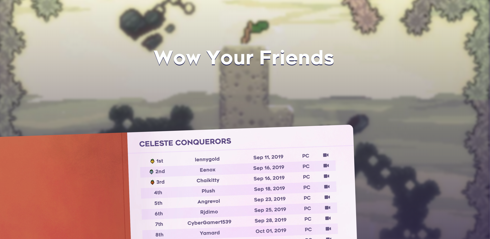

# Wow Your Friends

A small website dedicated to the players of Celeste that have completed the challenge of collecting every single strawberry in the game.

https://wowyourfriends.netlify.com/

## What is this exactly?
**Celeste** is a game about climbing a mountain, but more accurately, climbing your mountain. It's personally one of my favorite games of all time because of how well-crafted it is, from its story to its game design to its challenge towards all skill levels.

One of those challenges, which could be considered the hardest of them all, is collecting all 202 strawberries. The majority of them are search-and-collect, but then there are the *golden strawberries*. These are much harder to collect, as they can only be collected by completing a chapter without dying, from start to finish. Not many have persevered that far to collect them all.

And recently, Celeste had gotten its long-awaited DLC: *Chapter 9: Farewell*. And this introduced one more golden strawberry into the mix, which is, by far, the hardest berry to be collected. Only about a dozen, verified players had been able to obtain that berry after a couple of months; & quite a few more are hoping to join that group of players.

This is where this comes in. *Wow Your Friends* is a record of every player who managed to get every strawberry in Celeste. It's a really enduring task for players to go for this, & this is why I want to commemorate the efforts of those players in a more meaningful way. It's not easy, trust me.

## I want to be a part of this list!

Well first, you'll need to get all of the berries, & to that, I wish you good luck. But if you happen to make that, congrats! Seriously, that ain't easy.

To submit yourself into the journal, you must provide proof of you collecting Farewell's golden strawberry in the form of a video. This video will show the whole run, from start to finish, with no Assist or Variants mode.

If you aren't able to record your run, you can instead submit a screenshot of your stats as proof. But due to how this can be abused, you'll be listed under a *screenshot* category. Entries under this caregory will be hidden by default.

Once you have your proof, upload it to a public site like YouTube, and then send me a message through [Reddit](https://www.reddit.com/message/compose/?to=TammyDanny&subject=I%20got%20the%20golden%20berry!), [Twitter](https://twitter.com/aCluelessDanny), or this repo's [Issues section](https://github.com/aCluelessDanny/wow-your-friends/issues) with a link to your proof and a celebratory message. I'll add you once I check and verify it!

#### Don't have a capture card for the Switch?

There's an alternative!

While you can record and/or stream on every other platform with relative ease, the Switch has no native streaming capabilities & can only record up to 30 seconds at a time.

But fortunately, we can still work with that! There are just a few extra requirements to verify that the run was legitimate:
- If you're unable to record your whole run with a capture card or camera, you can instead submit a *partial recording* made through the Switch's Share button.
- The recording must capture the moment of collecting the golden berry. Preferably hold the Share button right after the screen fades to white.
- Before collecting the berry, **open and close the pause menu for at least a second**. This is to prove that neither Assist nor Variants mode were used throughout the run.
- **A second video is required as proof**. This video will simply show your Switch playing the recording mentioned above from the HOME menu's Album applet. This is to verify the run was indeed done on a Switch.

## Special thanks

- A *huge* thanks to **/u/DJTom3** on Reddit for compiling the initial list of these players in his posts [here](https://www.reddit.com/r/celestegame/comments/dinrkb/with_their_amazing_achievement_of_getting_the/) and [here](https://www.reddit.com/r/celestegame/comments/dut721/in_the_wake_of_the_last_few_farewell_golden/). It's been my primary source of information & the push I needed to do this project.
- The **Celeste dev team** for creating once heck of a fantastic game to play through
- All of the players on this list for going above and beyond to complete such a task

> This website was made with React, Gatsby, & a bit of love.
